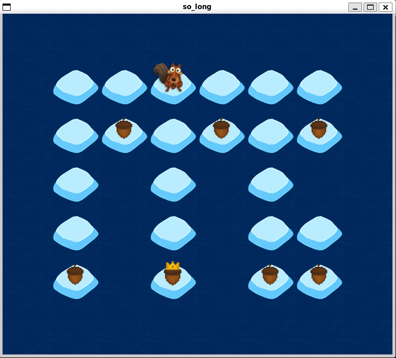

# So Long
## A 2D game

This project's purpose is to improve skills in window management, event handling, colors, textures, etc.

### How to use:
1) Inside the directory you want: `git clone https://github.com/mjbalouta/so-long.git`

2) Enter the so-long directory and `git clone https://github.com/42paris/minilibx-linux.git`

3) Type `make` and then `./so_long maps/map1.ber` or other available map on the maps folder.

4) Have fun playing my little game!

### Requirements

1) The program must take a map description file with the extension .ber as a parameter;

2) The number of movements must be displayed in the shell;

3) Your program has to display the image in a window;

4) Pressing ESC must close the window and quit the program in a clean way;

5) The use of the images of the minilibx is mandatory;

6) A valid map must contain 1 exit, 1 starting position, 1 collectable: 0 represents an empty space; 1 a wall; C the collectables; E que map exit and P the starting position of the player.

7) The map must be retangular and surrounded by walls;

8) We must verify is there's a valid path in the map;

9) If any misconfiguration is encountered in the file, the program must exit cleanly, and return "Error\n" followed by an explicit error message of your choice.

### Some notes from my Notebook:

**1) perror()**:
- used for printing a descriptive error message to stderr;
- typically used after a system call fails to provide insight into what went wrong.

**2) exit()**:
- used to terminate a program immediately, cleaning up resources and optionally returning a status code to the operating system.

**3) mlx_init()**:
- starts the connection with the graphical server. Returns a pointer to the connection.

**4) mlx_new_window()**:
- creates a window;
- returns a pointer to the window;

**5) mlx_loop()**:
- creates a loop to keep the window running.
